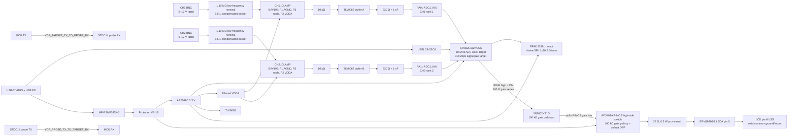

# Block Diagram

## Rev 0.2 status

The following architecture is locked for schematic capture but is not yet implemented or tested.

## Timing and rating annotations

- ADC sequence target: CH1 rank 1 then CH2 rank 2.
- Target timing: 12.5-cycle sample + 12.5-cycle conversion at 80 MHz, giving 312.5 ns skew and 1.6 Msps/channel at 3.2 Msps aggregate.
- These timing values require firmware and bench confirmation.
- Normal measurement rating is 0–12 V DC. Fifteen-volt survival is an unverified overload target, not a rating.

## Ground and safety

BNC shells, AGND/PCB ground, MCU ground, and USB ground are common. Rev 0.2 remains non-isolated and has no CAT, mains, high-energy, or negative-input rating.

Detailed interface pin dispositions and verification gates: [MVP Design Decisions](https://www.flux.ai/nbean/oscilloscope/files/mvp-design-decisions).

The high-side switch preserves the required solid VSS/backlight return on pin 6. The 27 Ω value remains provisional pending exact module Vf/current measurement, 60–75 mA acceptance, and resistor/MOSFET thermal verification. **No true schematic-capture blocker remains identified.**